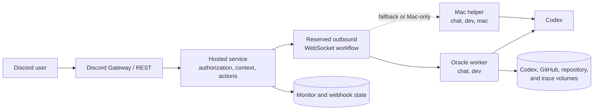

# Architecture

MiniSago separates Discord-facing authority from model execution. The hosted
service owns identity, permissions, context retrieval, and Discord mutations;
Codex runs on authenticated workers that connect outbound to the service.

## Deployment topology

No worker port is public. Oracle is the preferred always-on worker. The Mac
helper is a fallback and the only profile with access to explicitly requested
local Mac resources.

## Components

### Hosted service

The Bun service handles:

- Discord Gateway events, REST calls, and GitHub webhooks;
- chatbot authorization and requester-visible channel filtering;
- nearby context, history search, member aliases, and bounded Discord actions;
- worker authentication, reservation, routing, timeouts, and result delivery;
- scheduled reminders, vocabulary posts, and feed monitors; and
- persistent monitor and webhook state.

### Workers

Both workers run ephemeral Codex jobs with isolated configuration. Their
profiles are assigned by the bridge secret rather than advertised by the
worker:

| Profile | Capabilities         | Selection                               |
| ------- | -------------------- | --------------------------------------- |
| Oracle  | `chat`, `dev`        | Preferred when compatible and available |
| Mac     | `chat`, `dev`, `mac` | Fallback or explicit Mac target         |

Workers advertise only capacity, repository availability, and the repository
that owns chatbot behavior. A workflow remains reserved on one worker through
routing, evidence retrieval, and answering unless its required profile changes.

## Chat request lifecycle

1. The Gateway receives a human message and determines whether it is a mention,
   reply continuation, owner direct message, or timed follow-up.
2. The hosted service authorizes the requester and gathers nearby messages.
3. It reserves a compatible worker. Owner requests first run a bounded router
   that selects chat or development, default or Mac, repository, and any
   task-appropriate mutation scope for owner-requested work.
4. The service registers a short-lived, bearer-bound MCP session and dispatches
   one answer job.
5. Codex receives the request, nearby context, and supported answer attachments.
   It may call `resolve_context` for more history, accessible guild search,
   member aliases, or the previous observable trace.
6. Codex returns a structured reply and optional reaction or Mac file. The
   hosted service validates and posts the result to Discord.
7. The MCP token is revoked and the worker reservation is released.

Community and owner chat use GPT-5.6 Luna with high reasoning. The owner router
uses Luna with low reasoning; selected development work uses GPT-5.6 Sol with
medium reasoning. Ordinary stages have a two-minute timeout, while final owner
development answers may run for 15 minutes.

## Context and MCP

The hosted service exposes one Streamable HTTP MCP endpoint. Tokens are created
for one active workflow, expire after 16 minutes, and cannot select another
requester, guild, channel, worker profile, repository, or mutation scope.

The consolidated `resolve_context` tool can request, in parallel:

- additional current-channel history;
- searches across requester-visible guild channels;
- server aliases for named members; and
- bounded metadata about the previous answer.

Other tools cover Codex usage, reminders, voice, owner channel messages, and
owner emoji creation. Discord identity and destinations remain bound by the
host wherever possible.

Linux answer jobs also receive a worker-local stdio MCP server for media
attached to the active request. Its typed tools inspect media, transform images,
extract video frames, and produce bounded MP4, MP3, or GIF artifacts through
fixed FFmpeg presets. It accepts attachment IDs rather than paths or URLs and
has no network access. The server and its manifest are recreated for each job;
it is separate from the hosted authority-bearing MCP endpoint.

Reminder identity and destination are fixed to the requester and current
channel. Relative timers need no timezone; wall-clock and recurring requests
require an IANA timezone or an unambiguous location. Each requester may keep at
most 50 active reminders.

## Prompt harness and context policy

Workers compile every model call into three explicit authority layers:

1. stable MiniSago policy and the selected capability mode are passed as Codex
   developer instructions;
2. a short, fixed instruction states the task for answering, routing, or social
   action; and
3. the current request, Discord messages, attachments, repository choices, and
   tool results are labeled as untrusted context.

Codex receives the task as its prompt and the context over standard input.
Implicit repository instruction discovery is disabled for worker jobs, so files
such as `AGENTS.md` remain repository data unless the owner explicitly asks to
work with them. Mechanical permissions, MCP session binding, command wrappers,
and output schemas continue to enforce capabilities outside the prompt.

Initial messages, each message, extracted attachment text, and resolved MCP
context have deterministic character budgets in
`src/chatbot/context-policy.ts`. Selection keeps the newest messages, truncates
oversized items, and emits `context_omissions_json` metadata rather than hiding
loss. Taiwanese slang reference material is loaded only when Chinese appears in
the active context; identity, trust, and output policy always remain loaded.

Policy, task, and context formats have independent versions. Traces record
those versions and layer sizes, but never private reasoning. Prompt-injection
and budget cases are covered by structural evaluations in
`mac-agent/src/prompts/prompt-plan.test.ts`.

MiniSago has no model-managed long-term memory: worker jobs set Codex memories
off. Conversation state is request-scoped Discord context, while sanitized
operational traces are retained locally for 14 days and exposed only as bounded
metadata when a requester asks about a previous answer.

## Background features

The Gateway also handles Instagram link replies, quick-reply nudges, voice
state, and optional ambient reactions. Ambient messages are buffered without a
model call; a bounded delayed evaluation may add at most one validated reaction
and never produces an unsolicited reply.

Scheduled monitors and the GitHub webhook use persistent files for idempotency.
See [Configuration](configuration.md#persistent-state) for their paths and
[Operations](operations.md) for deployment and recovery.
